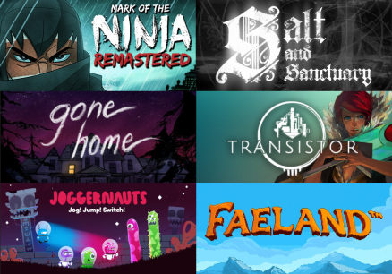

<!-- Sidebar -->
<section id="sidebar">
	

		<nav>
			<ul>
				<li><a href="#intro">Welcome</a></li>
				<li><a href="#one">Who we are</a></li>
				<li><a href="#two">What we do</a></li>
				<li><a href="#three">Get in touch</a></li>
				<li><a href="http://www.plasticfernstudios.com/clients">Our Clients</a></li>
			</ul>
		</nav>
	

</section>

<!-- Wrapper -->

<!-- Intro -->
<section id="intro" class="wrapper style1 fullscreen fade-up">
	

		
		<h1>Plastic Fern Studios</h1>
		
We offer QA, UX, Audio, and Management services so you can focus on what you love about game development

		<ul class="actions">
			<li><a href="#one" class="button scrolly">Learn more</a></li>
		</ul>
	

</section>

<!-- One -->
<section id="one" class="wrapper style2 spotlights">
	<section>
		
		

			

				<h1>Who We Are</h1>
				<h2>Development Services You Need</h2>
				
We are Plastic Fern Studios, a development and dev services studio based in San Diego! We help indies succeed in crafting their experiences for players while also developing our own unique games.

			

		

	</section>
	<section>
		
		

			

				<h2>Experience You Deserve</h2>
				
Plastic Fern Studios was started by Jay Fernandes, a manager, QA, and audio professional with over 8 years industry experience and 30+ shipped titles. Our team members' past experience can be seen in projects created by The Behemoth, Supergiant Games, Campo Santo, Fullbright, Edmund McMillen, and many others.

			

		

	</section>
	<section>
		
		

			

				<h2>We're Here to Help</h2>
				
Our passion for our work and the player's experience is the driving force in helping you achieve your game’s full vision. Our services currently include QA, UX, Accessibility, console release consults, project management, and all things related to audio including SFX, music production, and implementation.

			

		

	</section>
	<section>
		
		

			

				
We're working on a lot of interesting games with some pretty cool people! 

				<ul>
					<li><a href="https://www.nintendo.com/games/detail/salt-and-sanctuary-switch"> <b>Ska Studios</b></a> : Nintendo Switch Testing (QA/Lotcheck)</li>
					<li><a href="http://fullbrig.ht"> <b>Fullbright</b></a> : Steam PC Update for Gone Home (QA)</li>
					<li><a href="http://www.talegames.com"> <b>Talegames</b></a> : Faeland Demo (Music)</li>
					<li><b>Unannounced Projects for Switch, PS4, Xbox One, and Steam! (Releasing 2018)</b></li>
					 
					<ul class="actions">
						<li><a href="http://www.plasticfernstudios.com/clients" class="button scrolly">See More Clients</a></li>
					</ul>
				</ul>
			

		

	</section>
</section>

<!-- Two -->
<section id="two" class="wrapper style3 fade-up">
	

		<h1>What we do</h1>
		
We offer a variety of services to help make sure the process of making your game is as painless as possible and that the end product is something users can play and enjoy. We pride ourselves on our ability to integrate into any workflow from pre-production to post-launch in order to help. Reach out to us if you need something not listed or have questions!

		

			<section>
				
				<h3>Quality Assurance</h3>
				<ul>
					<li>PS4™, Xbox One, Nintendo Switch, and Steam PC Platforms</li>
					<li>Functional testing to squash any crashes, graphics, or other issues</li>
					<li>Console compliance testing for TRCs, XRs, and Lotcheck</li>
					<li>We can help manage external teams, porting houses, internal teams or processes</li>
					<li>Reports, bug database triage, risk assessments, and any other info you need to make the right decisions</li>
					<li>Need your own QA team internally? Let us help setup your workflow + train your team</li>
				</ul>
			</section>
			<section>
				
				<h3>UX/Accessibility</h3>
				<ul>
					<li>Have a professional help determine any possible issues with how a player interacts, understands, or generally enjoys your game</li>
					<li>Accessibility feedback to make sure your game is on the right track with considerations for cognitive disabilities, low or no-vision, auditory considerations, or other factors</li>
					<li>We offer Design, UX, Accessibility, + QA consults to make sure users experience the game how you want them to</li>
					<li>We can help playtest, survey, and study how users play your game then turn it into useful and actionable information for you</li>
				</ul>
			</section>
			<section>
				
				<h3>Sound Design</h3>
				<ul>
					<li>Custom sound effects (SFX) for your videogame, website, or trailer</li>
					<li>Years of experience creating memorable and a unique soundscapes for games</li>
					<li>Integration into engine using code or middleware into many popular engines (FMOD, Wwise, Unity, Unreal)</li>
				</ul>
			</section>
			<section>
				
				<h3>Music</h3>
				<ul>
					<li>Custom made or licensable music for your videogame, website, or trailer</li>
					<li>No matter the genre, we can help make something amazing sounding to fit the direction and feel of your experience</li>
					<li>Whether a short loop or custom music system, we have the technical knowledge to help</li>
				</ul>
			</section>
		

	

</section>

<!-- Three -->
<section id="three" class="wrapper style1 fade-up">
	

		<h2>Get in touch</h2>
		
Let's talk about your next project, help you finish out a current one, or chat about what we can help your game with!

		

			<section>
				<form method="post" action="https://formspree.io/info@plasticfernstudios.com">
					

						<label for="name">Name</label>
						<input type="text" name="name" id="name" />
					

					

						<label for="email">Email</label>
						<input type="text" name="email" id="email" />
					

					

						<label for="message">Message</label>
						<textarea name="message" id="message" rows="5"></textarea>
					

					<ul class="actions">
						<li><a href="" class="button submit">Send Message</a></li>
					</ul>
				</form>
			</section>
			<section>
				<ul class="contact">
					<li>
						<h3>Address</h3>
						1501 India St 103-79 
						San Diego, CA 92101 
						USA
					</li>
					<li>
						<h3>Email</h3>
						<a href="mailto:info@plasticfernstudios.com">info@plasticfernstudios.com</a>
					</li>
					<li>
						<h3>Social</h3>
						<ul class="icons">
							<li><a href="https://www.twitter.com/jaymfernandes" class="fa-twitter">Twitter</a></li>
						</ul>
					</li>
				</ul>
			</section>
		

	

</section>

