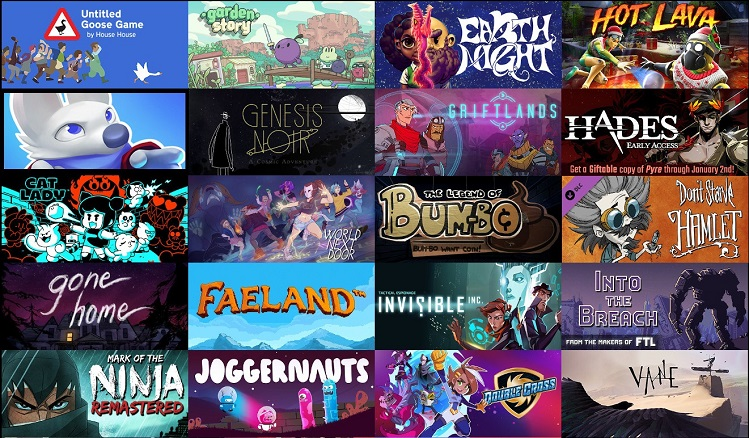

<!-- Sidebar -->
<section id="sidebar">
	

		<nav>
			<ul>
				<li><a href="#intro">Welcome</a></li>
				<li><a href="#one">Who we are</a></li>
				<li><a href="#two">What we do</a></li>
				<li><a href="#three">Get in touch</a></li>
				<li><a href="#four">Our Clients</a></li>
			</ul>
		</nav>
	

</section>

<!-- Wrapper -->

<!-- Intro -->
<section id="intro" class="wrapper style1 fullscreen fade-up">
	

		
		<h1>Plastic Fern Studios</h1>
		
We’re experts in what you need to release your game.

		

		
From porting to release management, our experienced team provides personalized and premium skills, insights, and deliverables to demystify the process of launching your game.

		<ul class="actions">
			<li><a href="#one" class="button scrolly">Learn more</a></li>
		</ul>
	

</section>

<!-- One -->
<section id="one" class="wrapper style2 spotlights">
	<section>
		
		

			

				<h2>Development Services You Need</h2>
				
We are Plastic Fern Studios, an indie development and dev services studio based in San Diego! We help studios succeed in releasing their games and navigating those processes.

			

		

	</section>
	<section>
		
		

			

				<h2>Experience You Deserve</h2>
				
Plastic Fern Studios was started by Jay Fernandes, with everyone having over 10 years industry experience and 30+ shipped titles. Our team members' past experience can be seen in projects created by The Behemoth, Supergiant Games, Campo Santo, Fullbright, Edmund McMillen, and many others.

			

		

	</section>
	<section>
		
		

			

				<h2>We're Here to Help</h2>
				
Our passion for our work and the player's experience is the driving force in helping you achieve your game’s full vision. Our services currently include Porting, Release Management, QA, and all things related to audio including SFX, music production, and implementation.

			

		

	</section>
	<section id="four" class="wrapper style2 spotlights">
	<section>
		
		

			

				<h2>Our Clients</h2>
				
We love working on great games with great teams! See what they have to say about us: 

				<ul>
				<li>The Plastic Fern folks are amazingly thorough, precise, and flexible. We've been super impressed! <b>- Jamie Cheng, Founder, Klei Entertainment</b></li>
					<li>We worked with Plastic Fern Studios at the end of EarthNight’s dev process and really wish we had known about them sooner. They helped us port to Switch, finalize PlayStation 4 and Steam builds and optimize the entire game... they seemed like members of the team who had been working in the project for years after only a few weeks. On top of clearly being technical wizards, the team was a pleasure to work with. We will unquestionably be using their services for future projects. <b>-Rich Siegel, Founder, Cleaversoft</b>
</li>
					<li>Plastic Fern provides highly experienced, intelligent, and responsive testers.  They jump right into the communication tools / databases our team uses and provide daily communication, giving our team with the support we need, on demand. <b>-Gavin Simon, Co-Founder, Supergiant Games</b></li>
				</ul>
			

		

	</section>
</section>

<!-- Two -->
<section id="two" class="wrapper style3 fade-up">
	

		<h1>What we do</h1>
		
From porting to release management, our experienced team provides personalized and premium skills, insights, and deliverables to demystify the process of launching your game. Reach out to us if you need something not listed or have questions!

		

			<section>
				
				<h3>Release Management</h3>
				<ul>
				<li>A step-by-step process to ensure you get through cert on almost any platform</li>
					<li>Getting your build packaged and ready to pass compliance</li>
					<li>A vast understanding of timelines and requirements</li>
					<li>Saves you time, brainpower, and mistakes</li>
				</ul>
			</section>
			<section>
				
				<h3>Porting</h3>
				<ul>
					<li>Programming and getting your build ready on almost any platform</li>
					<li>A one-stop-shop integrated team</li>
					<li>Meets and exceeds timelines to get you to your goal</li>
				</ul>
			</section>
			<section>
				
				<h3>QA</h3>
				<ul>
					<li>PS4™, Xbox One, Nintendo Switch, iOS, and Steam PC/Mac Platforms</li>
					<li>Premium testing with a high quality bar</li>
					<li>A diverse and experienced team that immerses themselves in you game for a more holistic perspective</li>
					<li>Understanding and communicating deadlines, needs, and requirements for each platform</li>
				</ul>
			</section>
			<section>
				
				<h3>Audio</h3>
				<ul>
					<li>Our team deeply immerses ourselves in every project, looking at it from an integrated lens and giving you audio that fits your game's needs</li>
					<li>A strong background in usability and game design, which ensures audio that enhances the player's experience</li>
				</ul>
			</section>
		

	

</section>

<!-- Three -->
<section id="three" class="wrapper style1 fade-up">
	

		<h2>Get in touch</h2>
		
Let's talk about your next project, help you finish out a current one, or chat about what we can help your game with!

		

			<section>
				<form method="post" action="https://formspree.io/info@plasticfernstudios.com">
					

						<label for="name">Name</label>
						<input type="text" name="name" id="name" />
					

					

						<label for="email">Email</label>
						<input type="text" name="email" id="email" />
					

					

						<label for="message">Message</label>
						<textarea name="message" id="message" rows="5"></textarea>
					

					<ul class="actions">
						<li><a href="" class="button submit">Send Message</a></li>
					</ul>
				</form>
			</section>
			<section>
				<ul class="contact">
					<li>
						<h3>Address</h3>
						1501 India St 103-79 
						San Diego, CA 92101 
						USA
					</li>
					<li>
						<h3>Email</h3>
						<a href="mailto:info@plasticfernstudios.com">info@plasticfernstudios.com</a>
					</li>
					<li>
						<h3>Social</h3>
						<ul class="icons">
							<li><a href="https://www.twitter.com/jaymfernandes" class="fa-twitter">Twitter</a></li>
						</ul>
					</li>
				</ul>
			</section>
		

	

</section>
